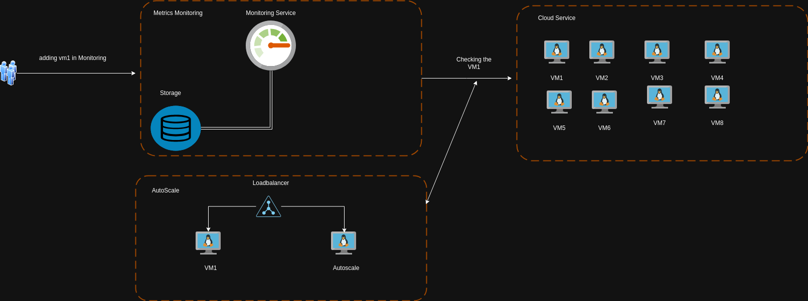

# Autoscaling in OpenStack with Python and Prometheus
* This repository provides a guide and code examples for implementing autoscaling in an OpenStack environment using Python and Prometheus.
Autoscaling is the process of automatically adjusting the number of compute resources in a cloud environment based on predefined rules and metrics. This repository demonstrates how to implement autoscaling in an OpenStack environment using Python for automation and Prometheus for monitoring and alerting.

### Prerequisites
* Access to an OpenStack environment.
* Python (version 3.8+)
* Prometheus and Grafana for monitoring.




If you want to use this project you must change the variable it depends on your Infrastructure.

## step1
adding your opensatck's Ip beside username/password.

```
vim api/config.py

cloud_ip = ""
username = ""
password = ""

```

## step2
copy the project to the OPT path

```
cp autoscale /opt/autoscale

cp autoscale_vm.service /etc/systemd/system/autoscale_vm.service

systemctl restart autoscale_vm.service
```